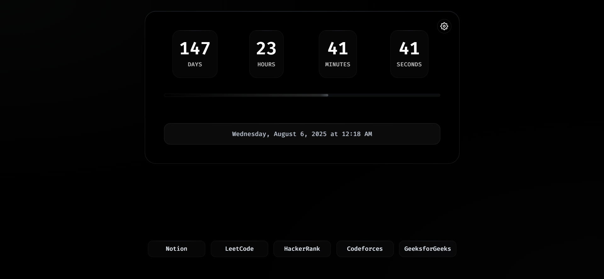
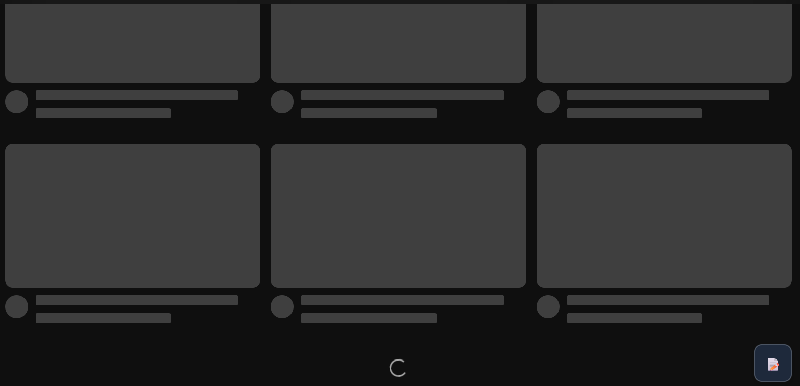
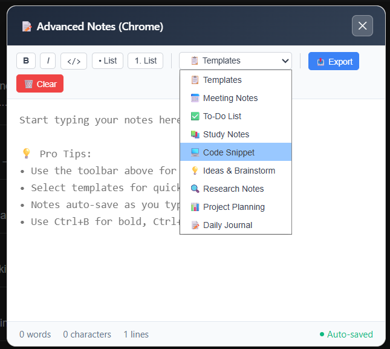

# YTimer - New Tab Extension

[](https://github.com/ManishKrBarman/ext-ytimer)
[](https://opensource.org/licenses/MIT)
[](https://developer.chrome.com/docs/extensions/mv3/intro/)
[](https://github.com/ManishKrBarman/ext-ytimer)

A powerful browser extension that transforms your new tab into a comprehensive productivity dashboard featuring year countdown, customizable quick links, tab groups, and advanced sticky notes with professional templates.

## 📸 Preview

| Feature | Screenshot |
|---------|------------|
| **New Tab Dashboard** |  |
| **Sticky Notes Toggle** |  |
| **Advanced Note-Taking** |  |

*Beautiful year countdown with progress visualization, convenient floating toggle for quick access, and professional sticky notes with rich formatting and templates*

## ✨ Features

### 🎯 Year Countdown Dashboard
- **Real-time countdown** to the end of the year with days, hours, minutes, and seconds
- **Progress visualization** with animated progress bar and percentage display
- **Celebration effects** when less than 24 hours remain
- **Toggle visibility** for progress text and seconds display
- **Responsive design** that adapts to all screen sizes

### 📱 Quick Links Management
- **Drag & Drop** reordering of links with visual feedback
- **Custom link creation** with automatic URL formatting
- **Visual grid layout** that adapts to your link count
- **Link groups** for organizing related bookmarks and collections
- **One-click link opening** and comprehensive management tools
- **Hide/show toggle** for distraction-free browsing

### 📝 Advanced Sticky Notes System
Experience powerful note-taking capabilities with browser-optimized features:

**Core Features:**
- **Browser-specific optimization**: Advanced UI for Brave, streamlined dialog for Chrome
- **Rich text formatting**: Bold, italic, code blocks, ordered/unordered lists
- **Smart auto-save**: Real-time saving with word, character, and line counting
- **Export functionality**: Save notes as text files for external use
- **Auto-fade on inactivity**: Notes become translucent during mouse inactivity (perfect for watching videos)

**Advanced Capabilities:**
- **Drag & resize**: Fully customizable positioning and sizing (Brave browser)
- **Multiple themes**: 5 professional color schemes (default, success, warning, danger, purple)
- **Floating toggle button**: Easy access with intelligent auto-fade functionality
- **Keyboard shortcuts**: Quick formatting with standard shortcuts (Ctrl/Cmd + B/I/S)

**Professional Templates:**
Choose from 8 professionally designed templates for various productivity needs:
1. **📅 Meeting Notes** - Structured format with agenda, attendees, and action items
2. **✅ To-Do List** - Organized task management with priority levels and completion tracking
3. **📚 Study Notes** - Academic format with key concepts, formulas, and summaries
4. **💻 Code Snippet** - Code documentation with syntax examples and explanations
5. **💡 Ideas & Brainstorm** - Creative thinking space with idea categorization
6. **🔍 Research Notes** - Research documentation with sources and findings
7. **📊 Project Planning** - Project management with timelines and resource allocation
8. **📝 Daily Journal** - Personal reflection and daily planning template

### 🎨 Customization Options
- **Multiple sticky note themes** with professional color schemes
- **Resizable and draggable** sticky notes (browser dependent)
- **Settings panel** for customizing all features and preferences
- **Responsive design** optimized for different screen sizes

## 🚀 Installation

### From GitHub Repository

**Prerequisites:**
- Google Chrome, Brave, or Edge browser
- Developer mode enabled in browser extensions

**Step-by-step Installation:**

1. **Download the Extension**
   ```bash
   git clone https://github.com/ManishKrBarman/ext-ytimer.git
   cd ext-ytimer
   ```
   Or download as ZIP from the [GitHub repository](https://github.com/ManishKrBarman/ext-ytimer) and extract it.

2. **Validate Extension Structure (Optional)**
   ```bash
   # Ensure all required files are present
   npm run build
   ```

3. **Open Browser Extensions Page**
   - **Chrome/Edge**: Navigate to `chrome://extensions/`
   - **Brave**: Navigate to `brave://extensions/`

4. **Enable Developer Mode**
   - Toggle the "Developer mode" switch in the top right corner

5. **Load the Extension**
   - Click "Load unpacked" button
   - Select the extension root folder (containing `manifest.json`)
   - The extension will be installed and automatically activated

6. **Verify Installation**
   - Open a new tab to see the Year Countdown dashboard
   - Look for the floating sticky notes toggle button (📝)

**Update Process:**
```bash
# Pull latest changes
git pull origin main

# Validate structure (optional)
npm run build

# Refresh extension in browser
# Click the refresh button (🔄) on the extension card
```

> **📁 Clean Structure**: This extension uses an organized file structure with all source code in the `src/` directory. No build process is required - it runs directly from source files.

## 🎮 How to Use

### New Tab Dashboard
**Year Countdown Features:**
- Open a new tab to see the real-time countdown automatically
- Click the progress bar to toggle percentage display
- Use keyboard shortcut `P` to toggle progress text visibility
- Click the settings gear icon to customize display options

**Quick Links Management:**
- Click the "+" button to add new links with auto-URL formatting
- Drag links to reorder them in your preferred arrangement
- Click "Create Group" to save collections of related links
- Use "Open Groups" to access and manage saved link collections
- Toggle visibility with the hide/show links button for distraction-free browsing

### Sticky Notes System

**Accessing Notes:**
Click the floating 📝 button to open your note-taking interface.

**Advanced Features (Brave Browser):**
- **Rich Text Formatting**: Use the toolbar for Bold, Italic, Code, and List formatting
- **Professional Templates**: Choose from 8 different templates for various use cases
- **Interactive Features**: Drag to reposition, resize by dragging corners, theme cycling
- **Smart Features**: Auto-fade during inactivity, real-time metrics, export functionality

**Chrome Compatible Mode:**
- Clean, accessible note-taking interface with same formatting options
- All templates available with keyboard shortcuts for quick formatting
- Auto-save, export capabilities, and auto-fade functionality included

## 🔧 Features by Browser

| Feature | Brave | Chrome | Other Browsers |
|---------|-------|---------|----------------|
| Year Countdown Dashboard | ✅ | ✅ | ✅ |
| Quick Links Management | ✅ | ✅ | ✅ |
| Tab Groups & Collections | ✅ | ✅ | ✅ |
| Basic Sticky Notes | ✅ | ✅ | ❌ |
| Advanced Sticky Notes UI | ✅ | ❌ | ❌ |
| Auto-fade During Inactivity | ✅ | ✅ | ❌ |
| Drag & Resize Notes | ✅ | ❌ | ❌ |
| Rich Text Formatting | ✅ | ✅ | ❌ |
| Professional Templates | ✅ | ✅ | ❌ |
| Note Export Functionality | ✅ | ✅ | ❌ |
| Multiple Note Themes | ✅ | ❌ | ❌ |

## ⌨️ Keyboard Shortcuts

### Global
- `P` - Toggle progress text visibility
- `Ctrl/Cmd + R` - Refresh page
- `Escape` - Clear focus from active element

### Sticky Notes
- `Ctrl/Cmd + B` - Bold formatting
- `Ctrl/Cmd + I` - Italic formatting
- `Ctrl/Cmd + S` - Save (auto-save is always active)

## 🔒 Privacy

- **No data collection**: All data is stored locally in your browser
- **No external servers**: Everything runs locally
- **No tracking**: No analytics or user behavior tracking
- **Open source**: Full transparency with source code available

## 🛠️ Technical Details

### Architecture
- **Manifest V3** compatible with modern Chrome extension standards
- **Service Worker** based background script for efficient resource management
- **Content Scripts** for seamless web page integration
- **Local Storage** for all user data - no external dependencies
- **Modular Structure** with organized source code in `src/` directory

### Code Organization
```
src/
├── js/
│   ├── background.js    # Service worker with alarms and notifications
│   ├── content-script.js # Sticky notes injection for web pages  
│   └── newtab.js       # Main dashboard functionality
├── css/
│   ├── styles.css      # New tab interface styling
│   └── sticky-note.css # Sticky notes themes and animations
└── html/
    └── newtab.html     # New tab page structure
```

### Performance & Compatibility
- **Cross-browser compatibility** detection with browser-specific optimizations
- **Responsive CSS** with modern design patterns and animations
- **Error handling** with comprehensive try-catch blocks and fallbacks
- **Build validation** ensuring all required files and dependencies exist
- **Browser-optimized code** with no Node.js dependencies in runtime files

## 🤝 Contributing

1. Fork the repository
2. Create a feature branch (`git checkout -b feature/amazing-feature`)
3. Commit your changes (`git commit -m 'Add amazing feature'`)
4. Push to the branch (`git push origin feature/amazing-feature`)
5. Open a Pull Request

## 📝 License

This project is licensed under the MIT License - see the [LICENSE](LICENSE) file for details.

## 🐛 Bug Reports

Found a bug? Please open an issue on GitHub with:
- Detailed description of the problem
- Steps to reproduce
- Browser version and OS
- Screenshots if applicable

## 🚀 Roadmap

- [ ] Dark/Light theme toggle
- [ ] Cloud sync for settings and notes
- [ ] More sticky note themes
- [ ] Integration with calendar services
- [ ] Mobile companion app
- [ ] Export to various formats (PDF, Markdown)
- [ ] Collaborative sticky notes

## 📊 Stats

- **Manifest Version**: 3
- **Supported Browsers**: Chrome, Brave, Edge
- **File Size**: < 500KB
- **Performance Impact**: Minimal
- **Privacy**: 100% Local

---

[📁 GitHub Repository](https://github.com/ManishKrBarman/ext-ytimer) | [🐛 Report Issues](https://github.com/ManishKrBarman/ext-ytimer/issues) | [💡 Feature Requests](https://github.com/ManishKrBarman/ext-ytimer/discussions) | [📖 Documentation](https://github.com/ManishKrBarman/ext-ytimer/wiki)

---

<div align='center'>
🌟 thanks for visiting 🌟
</div>